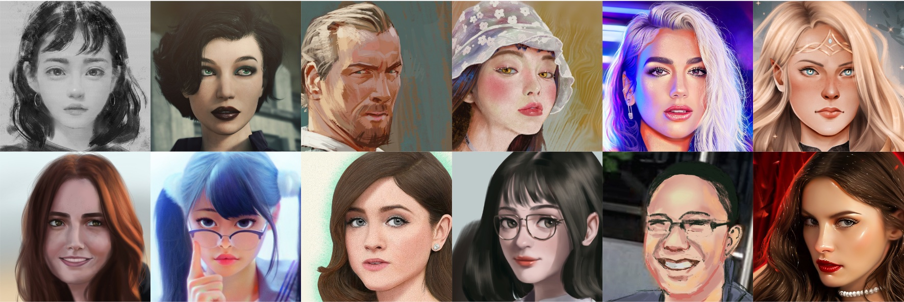

# Artstation-Artistic-face-HQ Dataset (AAHQ)



Artstation-Artistic-face-HQ (AAHQ) is a high-quality image dataset of artistic-face images. It is proposed in:

> **BlendGAN: Implicitly GAN Blending for Arbitrary Stylized Face Generation**<br>
> Mingcong Liu, Qiang Li, Zekui Qin, Guoxin Zhang, Pengfei Wan, Wen Zheng<br>
> https://arxiv.org/abs/2110.11728

Images in this dataset are collected from the "portraits" channel of [Artstation](https://www.artstation.com). Since the original images are subject to copyright, we do not make them available directly. Instead, we provide URLs and associated face landmarks from the dataset. The dataset consists of about 25,000 high-quality artistic images (**less than the number in the paper because the original URLs of some images are invalid**). It offers a lot of variety in terms of painting styles, color tones and face attributes.

Please notice that this dataset is made available for academic research purpose only. The copyright of the images belongs to the original owners. The dataset itself (including JSON metadata, download script, and documentation) is made available under a [Creative Commons Attribution-NonCommercial-ShareAlike 4.0 International License](https://creativecommons.org/licenses/by-nc-sa/4.0/). You can **use, redistribute, and adapt it for non-commercial purposes**, as long as you (a) give appropriate credit by **citing our paper**, (b) **indicate any changes** that you've made, and (c) distribute any derivative works **under the same license**.


*If any of the images belongs to you and you would like it removed, please kindly inform [us](mailto:liumcong@gmail.com), we will remove it from our dataset immediately.*

**Caution: Images in AAHQ inherit all the biases of [Artstation](https://www.artstation.com). Please be careful of unintended societal, gender, racial and other biases when training or deploying models trained on this data.**

## Prepare dataset

### 1. download the original images from [Artstation](https://www.artstation.com) (~19G):
```bash
python download.py
```

### 2. crop and align the images (~24G):
```bash
python face_alignment.py
```

## Bibtex
If you use this dataset for your research, please cite our paper:
```
@inproceedings{liu2021blendgan,
    title = {BlendGAN: Implicitly GAN Blending for Arbitrary Stylized Face Generation},
    author = {Liu, Mingcong and Li, Qiang and Qin, Zekui and Zhang, Guoxin and Wan, Pengfei and Zheng, Wen},
    booktitle = {Advances in Neural Information Processing Systems},
    year = {2021}
}
```

## Acknowledgements

We sincerely thank all the reviewers for their comments. We also thank Zhenyu Guo for help in preparing the comparison to StarGANv2.
The face alignment code borrows heavily from [FFHQ](https://github.com/NVlabs/ffhq-dataset) dataset.
